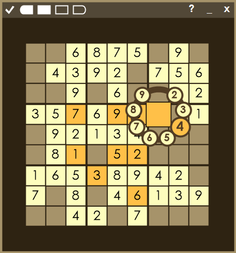

# Sudoku

A game of Sudoku.

One of my first programming projects made for a school assignment in February 2016. Code is relatively clean but is commented in Czech. Published for archival reasons.

	

## Features

- Very bad Sudoku puzzle generator (puzzles may be unsolvable)
- Nice visuals 🙂
- Solving aids

## Running the game

Download and run [Sudoku 3.exe](<https://github.com/swift502/V4-Sudoku/raw/main/Sudoku%203/bin/Debug/Sudoku%203.exe>) from the bin/debug folder.

To build the project, open the project solution in Visual Studio and Start the project.
